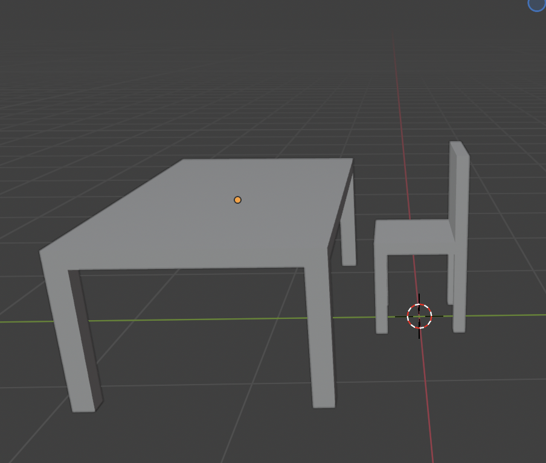
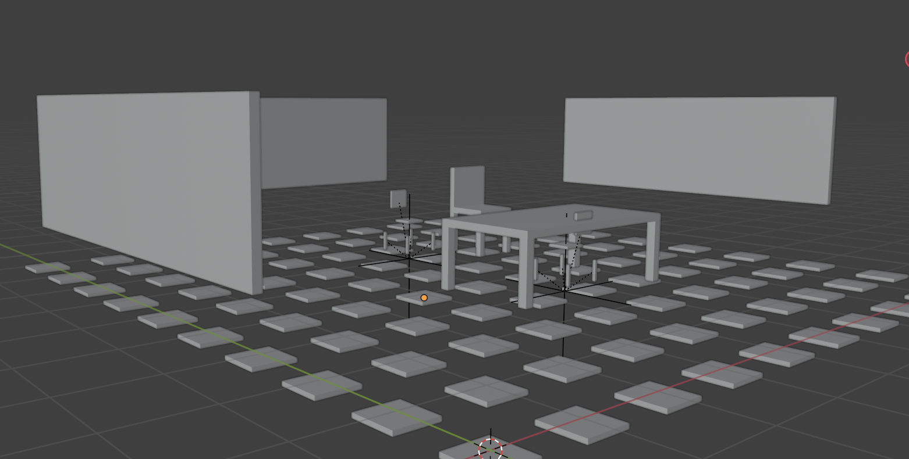
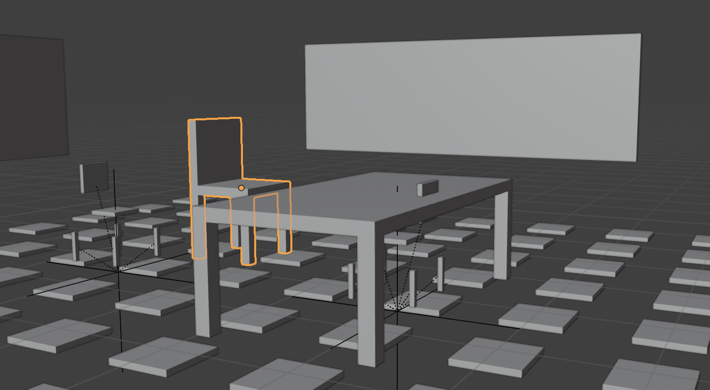

# ProceduralRoom

**ProceduralRoom** is a Blender & Python project that programmatically generates a furnished interior scene using procedural geometry and reusable assets.

The scene combines **scripted generation** (floor tiles, walls, furniture placement) with **manually modeled assets** (chair and table) that are dynamically appended and positioned via Python.

---
# **FINAL SCENES**

  
   
  
Blender Modeled Chair and Table Objects

  
    
  
   
  
Final Scenes

---
## Features

- Procedural room generation using Blender’s **Python API** (`bpy`)
- Checkerboard floor and modular wall layout
- Scripted furniture placement with transform control
- Reusable manual assets appended from a separate `.blend` file
- Fully reproducible scene generation with a single script run

---

## Tech Stack

- **Blender**
- **Python (bpy API)**
- Procedural geometry & asset pipelines

---

## How to Run

1. Open Blender
2. Switch to the **Scripting** workspace
3. Open `main.py`
4. Update the path to `manual.blend` if needed
5. Click **Run Script**

The full scene will be generated automatically.

---

# Author
`Kelvin Ihzeue`